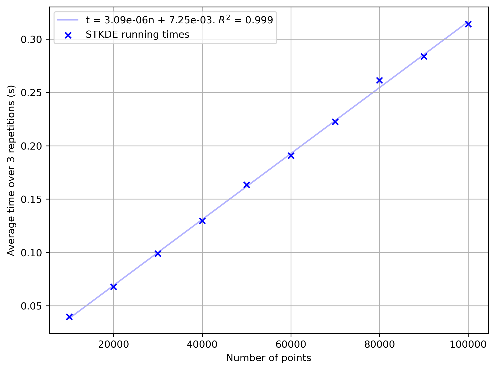
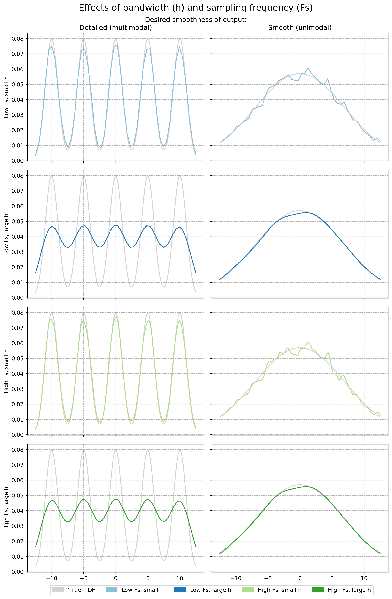

# wSTKDE
Visualising distributions of points in time and space is a common task across multiple fields of research, some examples are epidemiology, crime analysis, environmental science, traffic safety etc. This project provides a method for analysing these distributions of points using a Spatio-Temporal Kernel Density Estimation (STKDE) method. This is calculated using a custom **very fast algorithm** (STOPKDE), that scales linearly with the number of input points. This algorithm allows for STKDE calculation to happen in seconds, even for millions of points and voxels. To the extent of the author's knowledge this algorithm has not been applied in this context before, nor does it exist outside of this context. This project is mainly for researchers, or those with interest in using/improving on this method. The code written for this project is mainly written in [Numba](https://numba.readthedocs.io/en/stable/user/5minguide.html#a-5-minute-guide-to-numba), a just-in-time (JIT) compiler for Python and NumPy. This compilation allows for very fast computation, by sidestepping the inherent slowness of Python. This project is distributed free of charge under the open-source MIT License. 

<p align="center">
  
</p>
<p align="center" style="width: 85%; margin: 0 auto; font-size: 0.9em;">
  Figure 1: Animated example of weighted STKDE result for NYC traffic accidents. See the <a href="#example---new-york-city-traffic-accidents">example section</a> for more.
</p>

## Installation
To use this project please install the required dependencies using the provided environment.yml. If you also want to run the notebooks, make sure to install the optional dependencies required for that. Project has only been tested under Windows 10, but should work for Linux systems as well.

```bash
# Core environment
conda env create -f environment.yml
```
```bash
# Notebooks environment
conda env create -f environment.yml && conda install -n wstkde ipykernel>=6.29.5 matplotlib>=3.9.2 pyarrow>=17.0.0
```
## How to run
1. Import stkde and (geo)pandas
```python
import pandas as pd
import geopandas as gpd
from src.stkde import stkde
```
2. Import dataset to geopandas dataframe
```python
dataset = gpd.read_file(file_path)
```
3. Run the STKDE function on the imported dataset
```python
stkde(gdf=dataset, time_col='time_column', crs='EPSG:XXXX', number_of_voxels=(100,100,100),
      bandwidths=(500, 500, 10), output_file='output_file_name')
```

### Main function: `stkde`
This function calculates the Spatio-Temporal Kernel Density Estimation (STKDE) for points in a GeoDataFrame broadly following the method by Hu, et al. (2018).<br />

This function uses a custom very fast algorithm to calculate the STKDE called STOPKDE (Spatio-Temporal One-Pass Kernel Density Estimation). This algorithm outperforms the naive implementation by many orders of magnitude without compromising on the estimation quality. At time of writing this project is the only one STKDE implementation which supports weighted STKDE, where each of the points can be assigned a weight. If an output location is provided the result is stored as a visualisation toolkit (VTK) file. This function always returns the results as a NumPy array.  

#### Arguments:
| Argument                     | Type                       | Optional | Description                                                                                     |
|------------------------------|----------------------------|----------|-------------------------------------------------------------------------------------------------|
| `gdf`                        | GeoDataFrame               | ❌       | GeoPandas object containing the data for STKDE.                                                 |
| `time_col`                   | string                     | ❌       | The name of the column containing the time data in the GeoDataFrame.                             |
| `crs`                        | string                     | ❌       | Coordinate reference system to calculate the STKDE for. Accepts formats shown [here](https://pyproj4.github.io/pyproj/stable/api/crs/crs.html#pyproj.crs.CRS.from_user_input).              |
| `number_of_voxels`           | Tuple[int, int, int]       | ❌       | Number of voxels for each axis (x, y, t), or per bandwidth depending on the 'voxel_method'.      |
| `voxel_method`               | 'constant' or 'adaptive'   | ✔️       | Method to calculate the voxel grid. Defaults to 'constant'.                                      |
| `bandwidths`                 | Tuple[float, float, float] | ✔️       | Bandwidths for the STKDE in the x, y, and t dimensions. See [KDEpy](https://kdepy.readthedocs.io/en/stable/bandwidth.html#bandwidth) for a 1D example of bandwidth effects. |
| `calculate_optimal_bandwidths` | bool                     | ✔️       | If True, bandwidths will be estimated using the method described in Hu et al. (2018). Defaults to False. If False, make sure to supply bandwidths. |
| `weight_col`                 | str                        | ✔️       | Name of the column in the GeoDataFrame that contains weights for each point. Defaults to None.                    |
| `output_file`                | str or pathlib.Path        | ✔️       | Path to save the output to a VTK file. If None, the output will not be saved. Defaults to None.  |
| `verbose`                    | bool                       | ✔️       | If True, the function will print progress updates during the computation. Defaults to True.      |

For advanced users who prefer not to use the more user-friendly *stkde* function, the *calculate_stkde_for_voxel_grid* and *calculate_stkde_for_voxel_grid_weighted* functions are available. Please be aware these may not raise proper error messages if crashes occur. Documentation for these is present in the code. 

## Example - New York City traffic accidents
For a concrete example please take a look at the [stkde_example.ipynb](./notebooks/stkde_example.ipynb) notebook. This example uses a dataset of 1.8 million motor vehicle crashes in New York City (New York Police Department (NYPD), 2024). The inputs and outputs for this example are provided in this repository. For visualising the output please see the [visualisation section](#visualisation). In the example both a seasonal pattern and an unexpected reduction in traffic accidents in New York City can be observed. The unexpected reduction can be attributed to COVID-19 lockdown measures. These kinds of patterns are expected to become visible through the use of this method. On a Windows 10 22H2 laptop, with a Ryzen 5 5500U and 3200MHz 16GB ram, this computation takes 0.35 seconds for nearly 1.8 million points and 1 million voxels. 

## How it works
This section provides a brief overview of how the STKDE method in this repository works. For a more complete theoretical overview of how STKDE in general works please see the [references](#references) listed below. 

### STKDE
The equation evaluated in this code can be written as follows for the weighted STKDE:

$$
\hat{f}(x, y, t) = \frac{1}{n_{\textit{eff}} \cdot h_x \cdot h_y \cdot h_t} \sum_{i=1}^{n} W_i \cdot k \left( \frac{x - X_i}{h_x} \right) \cdot k \left( \frac{y - Y_i}{h_y} \right) \cdot k \left( \frac{t - T_i}{h_t} \right)
$$

Where:
- $\hat{f}(x, y, t)$ is the [probability density](https://en.wikipedia.org/wiki/Probability_density_function) for a location in space and time with coordinates $x,y,t$.
- $n_{\textit{eff}}$ is the effective number of points, calculated using Kish's effective sample size (Kish, 1965). This method is also used in [SciPy](https://docs.scipy.org/doc/scipy/reference/generated/scipy.stats.gaussian_kde.html#gaussian-kde). In non-weighted applications this is replaced with the number of points $n$.
- $h_x,h_y,h_t$ are the bandwidths in each dimension.
- $X_i,Y_i,T_i$ are the coordinates and $W_i$ is the optional weight of a point in the dataset.
- $k()$ is a [kernel function](https://en.wikipedia.org/wiki/Kernel_(statistics)), specifically the Epanechnikov kernel in this project. We define this kernel function as:
 $k(u)=\frac{3}{4}(1-u^2)$ if $u^2<1$, else $k(u) = 0$.

This equation is a slightly modified version of the STKDE function presented by Hu, et al. (2018), their version utilises 'generalised product kernels', instead of a bivariate spatial kernel. This has the main benefit of allowing users to specify independent spatial bandwidths, reasons for doing so are elaborated on in their paper. The method presented here adds support for _weighted_ Spatio Temporal Kernel Density Estimation. While not groundbreaking as a method, it is useful for certain applications. 

### Voxel grid
We create an encompassing [voxel](https://en.wikipedia.org/wiki/Voxel) grid around the point dataset. By evaluating the equation above for this entire grid, the STKDE is calculated for the entire area and time period of interest. This is a common approach in STKDE applications. The voxel grid is stored in a 3D array with $x_{num}$ voxels in the x-dimension, $y_{num}$ voxels in the y-dimension, and $t_{num}$ voxels in the t-dimension.

### Performance
Because the above equation applied in raw form leads to a time complexity of $O(n \cdot m)$, where $n$ is the number of points and $m$ is the number of measurement locations (or voxels), optimisations are required to apply this equation to large datasets. Excellent optimisation work has been done for LIBKDV (Chan et al., 2022). However, the STKDE equation used there uses a bivariate spatial kernel, while this work uses multiple univariate kernels. This allows for optimisations not applicable to their methods, as a result of which this implementation is theoretically significantly faster, while using less memory. If performance is a priority, and the use of the bivariate spatial kernel is not a requirement, the algorithm presented here is a more efficient solution. To the extent of the authors' knowledge there is no published research on optimising the computational performance of the generalised product kernel version of the STKDE equation. 

The optimisation relies on the fact that the Epanechnikov kernel is bounded. If a point is beyond a bandwidth distance from a voxel in any direction, the contribution of that point to said voxel is 0. By knowing if a point is outside of bandwidth distance before calculating the Epanechnikov kernels we can dramatically reduce the number of operations performed. 

The method applied here takes advantage of the fact that the voxels are spaced equidistantly. For simplicity, see the following one-dimensional example. We have a point $p=4$, a bandwidth $h=2$, and a set of voxels $v$ with coordinates $`\{1,3,5,7,9\}`$. The set $v$ has a length $l=5$, and constant distance $d=2$. Firstly, we transform both the bandwidth and the point to be expressed in index values. For the bandwidth, $h_i= \frac{h}{d} = 1$. For the point, $p_i = \frac{p - v_{min}}{d} = 1.5$. To discover which voxels are within range we calculate the lower bound index and the upper bound index.

$$
lb = max(\lceil p_i - h_i \rceil, 0)
$$
$$
ub = min(\lceil p_i + h_i \rceil,l)
$$

 This results in $lb=1$ and $ub=3$, which results in the subset $`\{3,5\}`$
, assuming 0-based indexing and half-open range indexing. In another language you might have to clamp the index values instead of using min and max, to avoid out-of-bounds errors.  


As explained previously the grid is stored in a 3D array with shape $(x_{num}, y_{num}, t_{num})$. By calculating the indices in the way described above for every dimension, the voxels that a point affects are identified. This calculation can occur on a point-by-point basis in constant time, as this calculation is not affected by bandwidth sizes, or number of voxels. 

A second technique used here attempts to minimise storage issues by taking advantage of the summation in the STKDE equation. Now that we know which voxels are affected by the point, we can calculate the Epanechnikov kernel for each voxel and dimension. By combining this with some precomputation of the unique Epanechnikov kernel values per point, all that is left to do is essentially a cartesian product calculation. We add the values from this cartesian product to the 3D array, which was initially filled with zeroes. The full method presented here essentially eliminates duplicate kernel calculations entirely. This means that the main time complexity of the STOPKDE method, while still dependent on the bandwidth and voxel sizes, is essentially linear in the number of points. Namely: 

$$
O(n \cdot \frac{2h_x}{x_{size}} \cdot \frac{2h_y}{y_{size}} \cdot \frac{2h_t}{t_{size}})
$$

The latter three terms being the number of voxels that a point influences. See the figure below or the [_performance.ipynb notebook_](./notebooks/performance.ipynb) for an example that supports this theoretical complexity.

<p align="center">
  
</p>
<p align="center" style="width: 85%; margin: 0 auto; font-size: 0.9em;">
  Figure 2: Time taken by STOPKDE for increasing input sizes. Bandwidths set to 5.0, number of voxels = 100<sup>3</sup>, point values randomly selected between 0 and 100.
  Evaluation run on laptop with AMD Ryzen 5 5500U and 16GB 3200MHz ram runnning Windows 10 22H2 .
</p>
</br>

The storage requirement for this algorithm is dependent on the same three terms, but not multiplicatively. Rather, the space complexity is likely $O(m + \frac{2h_y}{y_{size}} + \frac{2h_t}{t_{size}})$. The x term is removed as the X kernel is not precomputed but rather computed on the fly. This could be reduced to just $O(m)$ by computing all the kernels on the fly, but this recomputes kernels and is quite a bit slower because of the exponent. This space complexity is near optimal, as the output size is $m$.

It is important to mention that the algorithm does require two extra steps in addition to the main algorithm. The first is to fill the array with zeroes and the second is a loop over the array to multiply the sums with the normalization factor from the equation. Only when the number of points and the three terms are relatively small does this affect the overall runtime significantly.

To profit the most from this algorithm it is crucial to keep the three terms, or resolution factors, small if you want high performance. To see the effects of these variables on time taken we refer the reader to the [_performance.ipynb notebook_](./notebooks/performance.ipynb) in this repository. If the bandwidths or voxel size need to be adjusted, a good rule-of-thumb is to change both by the same amount, which gives roughly the same runtime. Of course, doubling voxel size means halving resolution (or number of voxels). While this may seem to be an undesirable limitation, decreasing the resolution is often possible without affecting the output much. This is especially true for larger bandwidth sizes in relation to the full distribution. The figure below shows that, with increased sampling frequency, a Kernel Density Estimate with a smaller bandwidth improves more those with a larger bandwidth. Therefore, a consideration needs to be made if the additional detail offered by the increased sampling frequency is worth the performance penalty when estimating with large bandwidths in relation to the voxel sizes. For smaller bandwidths, performance issues are less of a concern, as they are inherently more efficient. However, if the bandwidth is smaller than the sampling step size, the opposite issue can arise. To address this, it is recommended to use a higher sampling frequency when working with smaller bandwidths.

<p align="center">
  
</p>
<p align="center" style="width: 85%; margin: 0 auto; font-size: 0.9em;">
  Figure 3: Effects of different sampling frequency and bandwidths on Kernel Density Estimation for two distributions, one multimodal and one unimodal.
  See <a href="./notebooks/variance_based_sampling.ipynb" target="_blank" style="text-decoration: none;"><em>variance_based_sampling.ipynb</em></a> for the code used to generate this image.
</p>
<br>

The algorithm implemented here is single-threaded, as Numba currently does not support CPU atomics see [this thread](https://github.com/numba/numba/issues/2988). It is of course entirely possible for this algorithm to be run in parallel without atomic adds by creating a thread-local 3D array, but this is not a neat solution. As it stands it is likely that significant performance gains could be made by porting this algorithm to a language like C++ or Rust, which support atomic adds natively anyway. Therefore, if more performance is required, I would suggest parallelizing in either of these languages, leveraging atomic operations to do so. It is also possible that this algorithm could be run on a GPU instead of the CPU, but that is beyond my current understanding. 

## Visualisation
The outputs of the STKDE can be visualised in 3D with any software that supports [.vti files](https://docs.vtk.org/en/latest/design_documents/VTKFileFormats.html), the author recommends ParaView (Ayachit, 2015), which can be downloaded through from the official [ParaView webpage](https://www.paraview.org/). To recreate the example NYC visualisation open the ParaView state file [_nyc_traffic.pvsm_](./notebooks/output/nyc_plots/nyc_traffic.pvsm) in ParaView, and select the _Search files under specified directory_ option for _Load State Data File Options_. Then make sure to select the _output_ directory in the repository. This should load the datasets into ParaView, as well as a basemap of the New York Burroughs (New York City Department of City Planning (DCP), 2013). Alternative visualization methods are of course also possible, such as plotting voxels as points for each temporal slice to generate an animation, or slicing through the ParaView Isosurface visualisation, I will leave this up to you to implement. 

## Limitations
- Because this method relies on a bounded kernel, the optimisations shown here do not apply to unbounded kernels such as the Gaussian kernel.
- There is currently no implemented form of edge correction.
- Automatic bandwidth generation method does not scale well beyond 100,000 points. Ideal solution would be a 3D range tree, which proved difficult to implement in Numba.
- No other bandwidth selection methods, such as Scott, Silverman or ISJ are implemented.
- Not multithreaded yet (see performance section).
- No inbuilt visualisation method.
- No options for using other bounded kernels.
- No options for dynamic bandwidth sizes. 

## References

Spatio-Temporal Kernel Density Estimation:
- Chan, Tsz Nam, Ip, Pak Lon, Zhao, Kaiyan, U, Leong Hou, Choi, Byron, & Xu, Jianliang. (2022). LIBKDV: A versatile kernel density visualization library for geospatial analytics. _Proceedings of the VLDB Endowment_, 15(12), 3606–3609. https://doi.org/10.14778/3554821.3554855 
- Hu, Y., Wang, F., Guin, C., & Zhu, H. (2018). A spatio-temporal kernel density estimation framework for predictive crime hotspot mapping and evaluation. _Applied Geography, 99_, 89-97. https://doi.org/10.1016/j.apgeog.2018.08.001

Other references:
- Ayachit, U. (2015). _The paraview guide: a parallel visualization application._ Kitware, Inc.
- Kish, L. (1965). _Survey sampling_. 
- New York City Department of City Planning (DCP). (2013). _Borough Boundaries_ [Dataset]. NYC OpenData. https://data.cityofnewyork.us/City-Government/Borough-Boundaries/tqmj-j8zm
- New York Police Department (NYPD). (2024). _Motor vehicle collisions - crashes_ (Version 2024/10/06) [Dataset]. NYC OpenData. https://data.cityofnewyork.us/Public-Safety/Motor-Vehicle-Collisions-Crashes/h9gi-nx95/about_data

## Citation
If you do end up using this project in any published work, please cite this repository using the provided .cff file (also, thanks!). Additionally make sure to cite Hu, et al. (2018).


